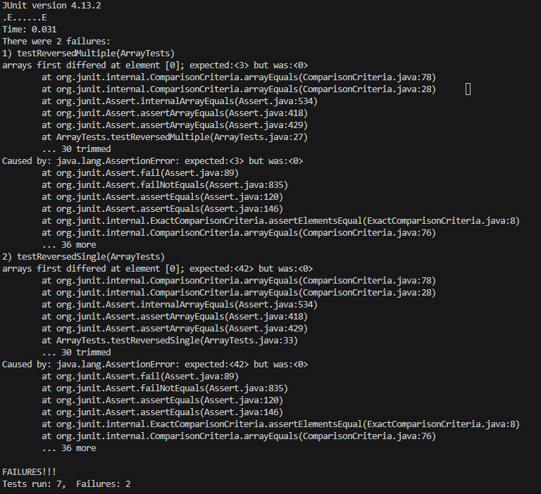

# Part 1
For the test, I choose the `reversed` method, which inputs an array and returns a *new* array in reversed order, code for the method:
```java
  static int[] reversed(int[] arr) {
    int[] newArray = new int[arr.length];
    for(int i = 0; i < arr.length; i += 1) {
      arr[i] = newArray[arr.length - i - 1];
    }
    return arr;
  }
```

Out of 3 tests, only one of them didn't fail, `testReversedEmpty`, code of the tests:


## Failure inducing inputs:
```java
  @Test
  public void testReversedMultiple() {
    int[] input1 = { 1, 2, 3 };
    assertArrayEquals(new int[]{3, 2, 1 }, ArrayExamples.reversed(input1));
  }
```
Where:
- Input: `{ 1, 2, 3 }`
- Expect: `{ 3, 2, 1 }`
- Output: `{ 0, 0, 0 }`

```java
  @Test
  public void testReversedSingle() {
    int[] input1 = { 42 };
    assertArrayEquals(new int[]{ 42 }, ArrayExamples.reversed(input1));
  }
```
Where:
- Input: `{ 42 }`
- Expect: `{ 42 }`
- Output: `{ 0 }`

## No Failure inputs:
```java
  @Test
  public void testReversedEmpyt() {
    int[] input1 = { };
    assertArrayEquals(new int[]{ }, ArrayExamples.reversed(input1));
  }
```
Where:
- Input: `{ }`
- Expect: `{ }`
- Output: `{ }`

## Symptom
For all inputs, the method returns a new array of the same length, but with all elements being 0. 

## Bug resolve
Instead of creating a new array for `newArray`, we need to clone the input array into it.
#### Before:
```java
  static int[] reversed(int[] arr) {
    int[] newArray = new int[arr.length];
    for(int i = 0; i < arr.length; i += 1) {
      arr[i] = newArray[arr.length - i - 1];
    }
    return arr;
  }
```
#### After:
```java
  static int[] reversed(int[] arr) {
    int[] newArray = arr.clone();
    for(int i = 0; i < arr.length; i += 1) {
      arr[i] = newArray[arr.length - i - 1];
    }
    return arr;
  }
```
Since we use `newArray` to get elements of the input array in reversed order, we expect it to have the same values as the input list, but in reality, we don't even assign any values to it, we just create a new empty array. 

# Part 2
For this part, I choose the command `grep` with those command-line options:

## -i
Ignores the Upper/Lower case of the found lines:
#### Ex. 1:
Run:
```bash
grep -i "De" technical/biomed/1471-2091-3-17.txt 
```
Out:
```
Deviations of their ratio below unity (dotted lines)
          represent a decrease in [UCB], mainly from precipitation,
          but possibly also from limited degradation. At N = 0.31
          DMSO to dec
...
```

#### Ex. 2:
Run:
```bash
grep -i "De" technical/*/*.txt
```
Out:
```
technical/plos/pmed.0020249.txt:        challenges, we suggest considering transient viremia as successful infection and not to
technical/plos/pmed.0020249.txt:        The time interval between challenges is also an essential parameter in the design of
technical/plos/pmed.0020249.txt:        allow the identification of the challenge that gives rise to infection. Otherwise, the
...
```

## -c
Instead of returning lines, shows only the count of how many lines contain the input pattern:
#### Ex. 1:
Run:
```bash
grep -c "de" technical/biomed/1471-2091-3-17.txt 
```
Out:
```
65
```

#### Ex. 2:
Run:
```bash
grep -c "dec" technical/*/*.txt
```
Out:
```
technical/plos/pmed.0020048.txt:0
technical/plos/pmed.0020050.txt:17
technical/plos/pmed.0020055.txt:2
technical/plos/pmed.0020059.txt:0
technical/plos/pmed.0020060.txt:11

...
```


## -o
Instead of returning the entire line, it returns only the matching part of the input pattern:
#### Ex. 1:
Run:
```bash
grep -o "de" technical/biomed/1471-2091-3-17.txt 
```
Out:
```
de
de
de
de
de
...
```

#### Ex. 2:
Run:
```bash
grep -o "dec" technical/*/*.txt
```
Out:
```
technical/plos/pmed.0020216.txt:dec
technical/plos/pmed.0020216.txt:dec
technical/plos/pmed.0020216.txt:dec
technical/plos/pmed.0020216.txt:dec
technical/plos/pmed.0020216.txt:dec
technical/plos/pmed.0020232.txt:dec
...
```


## -l
Instead of returning the entire line, it returns the names of the files that contain it. 
#### Ex. 1:
Run:
```bash
grep -l "de" technical/biomed/1471-2091-3-17.txt 
```
Out:
```
technical/biomed/1471-2091-3-17.txt
```

#### Ex. 2:
Run:
```bash
grep -l "dec" technical/*/*.txt
```
Out:
```
technical/plos/pmed.0020192.txt
technical/plos/pmed.0020197.txt
technical/plos/pmed.0020198.txt
technical/plos/pmed.0020203.txt
technical/plos/pmed.0020206.txt
technical/plos/pmed.0020212.txt
technical/plos/pmed.0020216.txt
...
```

\* *All inline commands were referenced from https://en.wikibooks.org/wiki/Grep*
